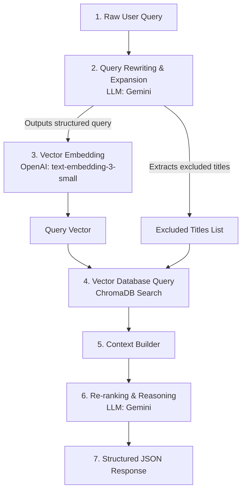

# Anime RAG API

This is the FastAPI web server for the Anime RAG application, deployed using Docker on Hugging Face Spaces.

## Local Development

1. Create a virtual environment and install requirements:
   ```bash
   python -m venv .venv
   source .venv/bin/activate  # Or .venv\Scripts\activate on Windows
   pip install -r requirements.txt
   ```
2. Start the FastAPI server locally:
   ```bash
   uvicorn app:app --reload --port 8000
   ```

## Core RAG Flow (`src/core.py`)

The application implements a Retrieval-Augmented Generation (RAG) pipeline tailored for anime recommendations. When a user runs a search, the flow executes the following steps inside [src/core.py](file:///D:/LT/Raganim/src/core.py):



### Detailed Pipeline Steps:

1. **Query Rewriting & Expansion (`_rewrite_query`)**
   * Uses Gemini (`gemma-4-31b-it`) to translate natural language user queries (e.g. *"dark mecha like Evangelion"*) into structured attributes: genres, tags, mood, setting, plot elements, and themes.
   * This aligns the search string format with how document entries are stored in the database, maximizing vector database retrieval accuracy.
   * If a user asks for recommendations *"similar to Anime X"*, **Anime X** is automatically parsed and added to an `excluded_titles` list so it doesn't appear in the final recommendations.

2. **Embedding Generation (`_embed`)**
   * Translates the structured search string into a high-dimensional dense vector (1536 dimensions) using OpenAI's `text-embedding-3-small` model.

3. **ChromaDB Vector Retrieval (`_vector_search`)**
   * Executes a vector search on the local SQLite-backed Chroma database (`chroma_db`) using cosine similarity.
   * If any `excluded_titles` were identified in Step 1, it filters them out.
   * Sorts candidate matches by a combination of vector relevance (similarity score) and MyAnimeList popularity score.

4. **LLM Re-ranking & Reason Generation (`_ask_llm`)**
   * Builds text context from the top retrieved matching documents.
   * Feeds the context to Gemini (`gemma-4-31b-it`) alongside the user's intent.
   * The LLM ranks all retrieved anime in terms of intent match quality (independent of raw database ranking) and generates a one-sentence user-friendly explanation (`why`) for each choice.

5. **Response Delivery (`search`)**
   * Packs recommendations into a structured JSON response returned through the `/search` FastAPI endpoint:
     - `query`: Original search term.
     - `rewritten_query`: The expanded structured version.
     - `message`: Context-aware message explaining the recommendations.
     - `recommendations`: Ranked array of anime showing Rank, Title, MyAnimeList Link, Score, and the reasoning (`why`).
     - `all_retrieved`: Raw relevance scores of matching entries.

