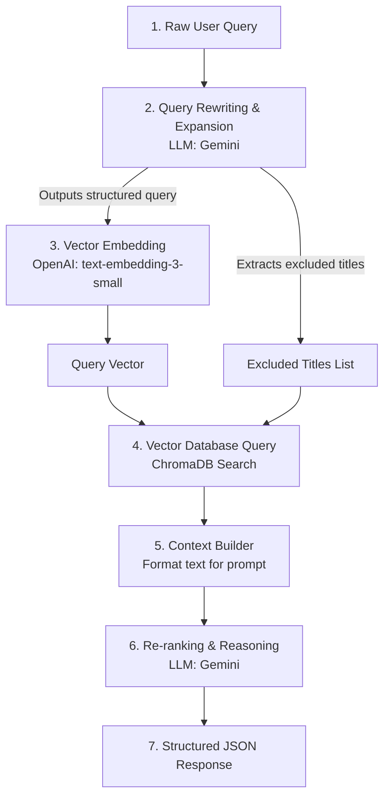

# Raganim — Anime Semantic Search & RAG Recommender

Raganim is an advanced semantic search and recommendation platform for anime. Rather than performing simple keyword matching, Raganim leverages a modern **Retrieval-Augmented Generation (RAG)** pipeline. Users can input natural language queries representing moods, settings, characters, or specific plot themes (e.g., *"a lone samurai seeking redemption"* or *"dark futuristic cyberpunk space battles"*), and the engine will semantically find the best matches, re-rank them using a Large Language Model, and generate explanations for why each result was recommended.

The backend is built with **FastAPI** (Python), backed by **ChromaDB** for vector storage, **OpenAI** for embedding generation, and **Google Gemini** for query expansion and re-ranking. The frontend is a clean, glassmorphic modern web interface built with vanilla HTML, CSS, and JavaScript.

---

## 🚀 Core RAG Architecture

When a search request is received by the backend, the RAG engine performs a multi-stage pipeline inside `src/core.py`:



---

## 🔍 Detailed Component Deep Dive

### 1. Structured Query Rewriting / Expansion (`_rewrite_query`)
Rather than converting raw natural language queries (like *"find anime action with magic portals similar to Solo Leveling"*) directly into embeddings, the engine leverages **Query Rewriting** to match the database's schema:

* **The Problem:** Anime records are saved in ChromaDB under a structured schema containing genres, tags, mood, settings, and themes (e.g. `genres: Action \n tags: Magic, Gate \n synopsis: ...`). A plain natural language query does not match this structure, which can degrade embedding cosine similarity performance.
* **The Solution:** 
  1. The raw query is processed by the LLM (`gemma-4-31b-it`) using the `response_mime_type="application/json"` config.
  2. The LLM extracts specific attributes: `genres`, `tags`, `setting`, `mood`, `themes`, `plot_elements`, `similar_to`, and `synopsis_keywords`.
  3. If the query asks for recommendations *similar to Anime X*, **Anime X** is parsed and placed in the `excluded_titles` array so that the input anime itself is filtered out from recommendations.
  4. The code concatenates these attributes using header tags mirroring the database format (e.g. `genres: <value>\ntags: <value>\nsynopsis: <value>`).
  5. The resulting **structured query string** is embedded and searched.

* **Example Output of Query Rewriter:**
  For user query: *"dark and gritty cyberpunk with mecha"*
  ```text
  genres: Action, Sci-Fi, Drama
  tags: Cyberpunk, Mecha, Post-Apocalyptic
  setting: dystopian futuristic city, dark alleys
  mood: dark and gritty, epic, melancholic
  themes: survival, technology, existential dread
  plot_elements: robot pilots, cybernetic enhancements
  synopsis: futuristic metropolis, giant mechs, dystopian world
  ```

### 2. Embedding Generation (`_embed`)
The rewritten query is converted into a high-dimensional vector:
* **Model:** OpenAI's `text-embedding-3-small`
* **Dimensions:** 1536
* **Role:** Captures the deep semantic meaning of the structured query string.

### 3. Vector Database Search (`_vector_search`)
The system queries the local ChromaDB SQLite-backed database (`chroma_db`):
* **Filtering:** If `excluded_titles` were parsed (e.g. the user searched *"similar to Naruto"*), any anime metadata containing "Naruto" will be automatically skipped during retrieval.
* **Scoring:** The database retrieves the top matches based on cosine distance. The system computes a relevance score (`1 - distance`) and sorts candidate matches combining the vector similarity with the MyAnimeList popularity `score`.

### 4. Context Builder (`_build_context`)
The **Context Builder** is a key preprocessing step that formats retrieved vector database results into a single clean string injected into the final LLM prompt.

* **Is it a prompt?** No, the Context Builder itself is *not* a prompt. Rather, it is a helper method (`_build_context` in `src/core.py`) that gathers raw database data and **builds the content context** that gets injected *into* the final prompt template.
* **How it works:**
  1. It loops through the raw list of dictionaries returned by ChromaDB vector search (`_vector_search`).
  2. For each result, it extracts the metadata (`title`, MyAnimeList `score`, MyAnimeList `url`, vector `relevance` distance) and the raw document body (`genres: ... \n tags: ... \n synopsis: ...`).
  3. It structures this data into a standardized numbered text format:
     ```text
     [1] Anime Title (MAL score: 8.5 | relevance: 0.95)
     genres: Action, Fantasy
     tags: Overpowered Protagonist, Magic
     synopsis: A story about...
     URL: https://myanimelist.net/...
     ```
  4. It returns a combined multi-line string. This combined context is then formatted directly into the main prompt in `_ask_llm()` at the `{context}` placeholder.

### 5. LLM Re-ranking & Reason Generation (`_ask_llm`)
* **Prompting & System Guidelines:** The structured context generated by the Context Builder is combined with the system prompt (`SYSTEM_PROMPT`) instructing the model to act as an expert anime recommender.
* **Reasoning (`why`):** The LLM compares all retrieved anime directly in-context, sorts them according to how well they align with the user's intent (which can differ from pure vector similarity), and generates a concise `why` explanation for why that specific anime was chosen.
* **Output enforcement:** The engine enforces strict JSON mode, requesting recommendations of exactly `N` items (matching the top-k retrieved list) to prevent hallucinations or missing links.

---

## 📂 Codebase Structure

* `app.py`: The entry point for the FastAPI web server. Manages lifespan initialization, CORS settings, Pydantic validation schemas, and REST endpoints.
* `src/core.py`: The core RAG pipeline engine implementation (`RagEngine` class, LLM prompt templates, embedding and ChromaDB calls).
* `src/config.py`: Configuration file loading keys and model configurations from environment variables.
* `frontend/`: Client UI assets.
  * `frontend/index.html`: UI layout, search input, chips, and loading states.
  * `frontend/style.css`: Premium styled layout (glassmorphism cards, gradients, and custom animations).
  * `frontend/script.js`: Handles API client connections to the backend, status UI updates, and results rendering.

---

## ⚙️ Configuration Variables (`src/config.py`)

The application loads settings from the environment. Main configurations include:
* `EMBED_MODEL`: Default is `text-embedding-3-small` (1536 dimensions).
* `LLM_MODEL`: Default is `gemma-4-31b-it`. Used for final re-ranking and explanation generation.
* `REWRITE_MODEL`: Default is `gemma-4-31b-it`. Used for query restructuring.
* `CHROMA_PATH`: Database path, defaults to `./chroma_db`.
* `COLLECTION`: Chroma collection, defaults to `anime_collection`.
* `TOP_K`: Default retrieval count is `10`.

---

## 📡 API Specification

### 1. Health Check
* **Endpoint:** `GET /health`
* **Response:**
  ```json
  {
    "status": "ok",
    "docs": 25282,
    "model": "gemma-4-31b-it"
  }
  ```

### 2. Search / Recommender Endpoint
* **Endpoint:** `POST /search`
* **Request Payload (`QueryRequest`):**
  ```json
  {
    "query": "dark mecha like Evangelion",
    "top_k": 10
  }
  ```
* **Response Payload (`QueryResponse`):**
  ```json
  {
    "query": "dark mecha like Evangelion",
    "rewritten_query": "genres: Sci-Fi, Drama, Mecha\ntags: Psychological, Post-Apocalyptic\nsynopsis: psychological distress, giant robot pilots, existential danger",
    "excluded_titles": ["evangelion"],
    "message": "Here are the top dark psychological mecha recommendations tailored for your search.",
    "recommendations": [
      {
        "rank": 1,
        "title": "Bokurano",
        "url": "https://myanimelist.net/anime/2508/Bokurano",
        "mal_score": 7.7,
        "why": "Features a dark plot where children pilot a giant mech at the cost of their own lives, heavily matching the existential dread of Evangelion."
      }
    ],
    "all_retrieved": [
      {
        "title": "Bokurano",
        "url": "https://myanimelist.net/anime/2508/Bokurano",
        "relevance": 0.8841
      }
    ]
  }
  ```

---

## 🛠️ Local Development Setup

### Backend Local Setup
1. **Create a Virtual Environment & Install Dependencies:**
   ```bash
   python -m venv .venv
   source .venv/bin/activate  # On Windows use: .venv\Scripts\activate
   pip install -r requirements.txt
   ```

2. **Configure Environment Variables:**
   Create a `.env` file in the root folder with the following variables:
   ```env
   OPENAI_API_KEY="your-openai-api-key"
   GEMINI_API_KEY="your-gemini-api-key"
   ```

3. **Start the FastAPI Server:**
   ```bash
   uvicorn app:app --reload --port 8000
   ```
   Once started, the API docs are accessible at: [http://localhost:8000/docs](http://localhost:8000/docs).

4. **Verify Application Health:**
   Send a GET request to `/health` to verify that the RAG engine and database connection are initialized correctly.

### Frontend Local Setup
To run the frontend client interface locally:
1. Open the `frontend/index.html` file directly in your browser, or serve it using any simple local static server (e.g., Live Server extension in VS Code or Python's HTTP server):
   ```bash
   cd frontend
   python -m http.server 8080
   ```
2. The frontend expects the backend server to be running on `http://localhost:8000`. You can configure the API URL inside `frontend/script.js`.


